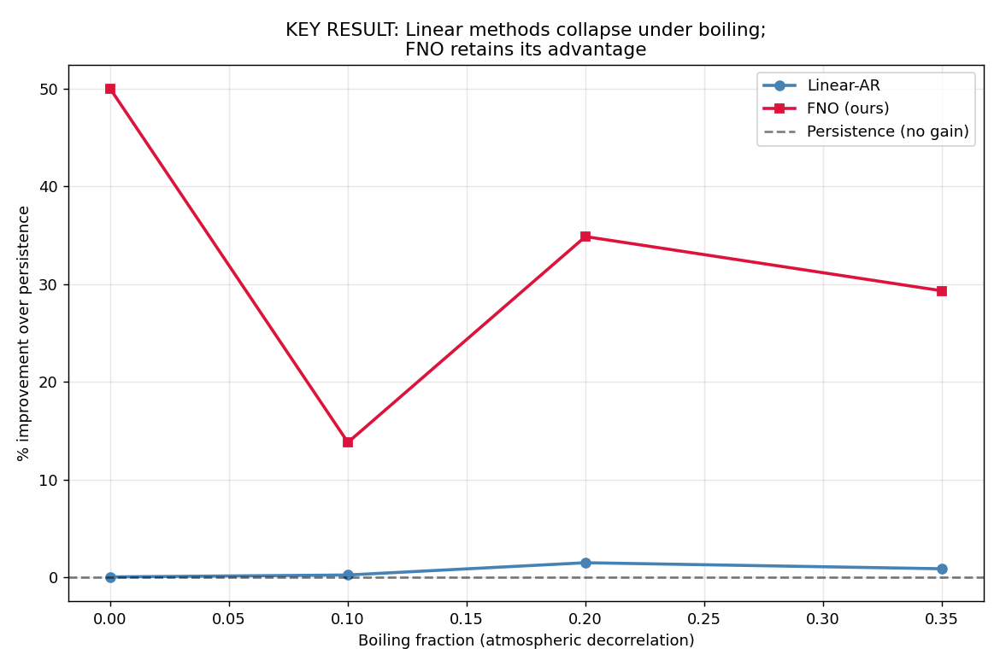
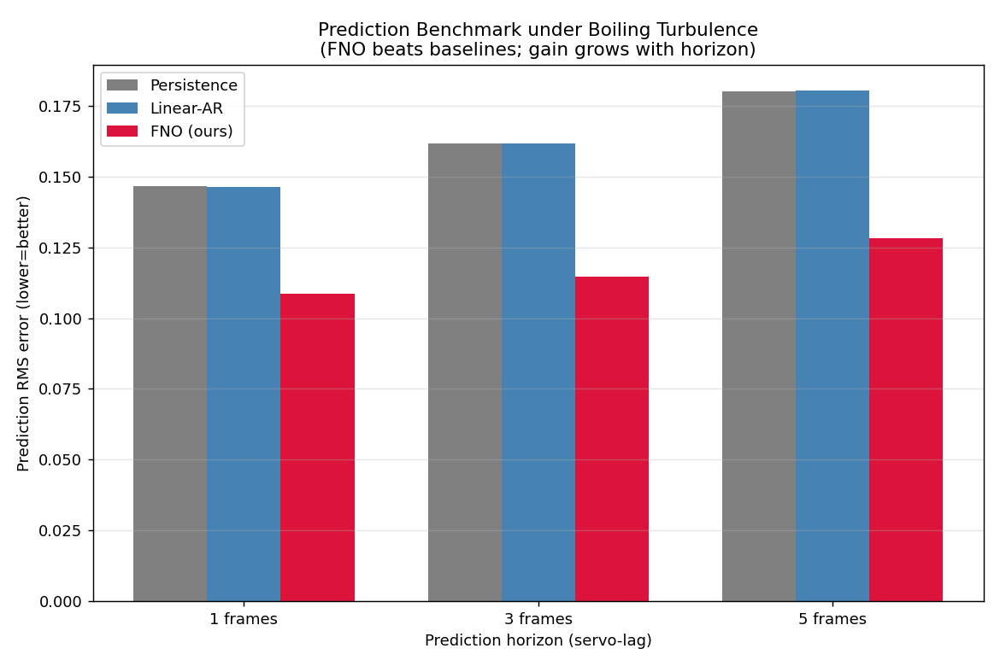
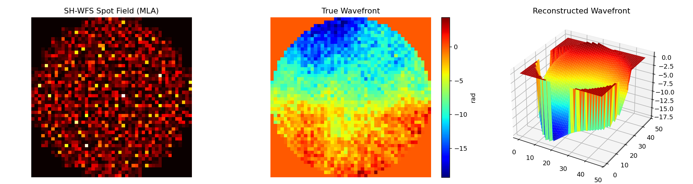
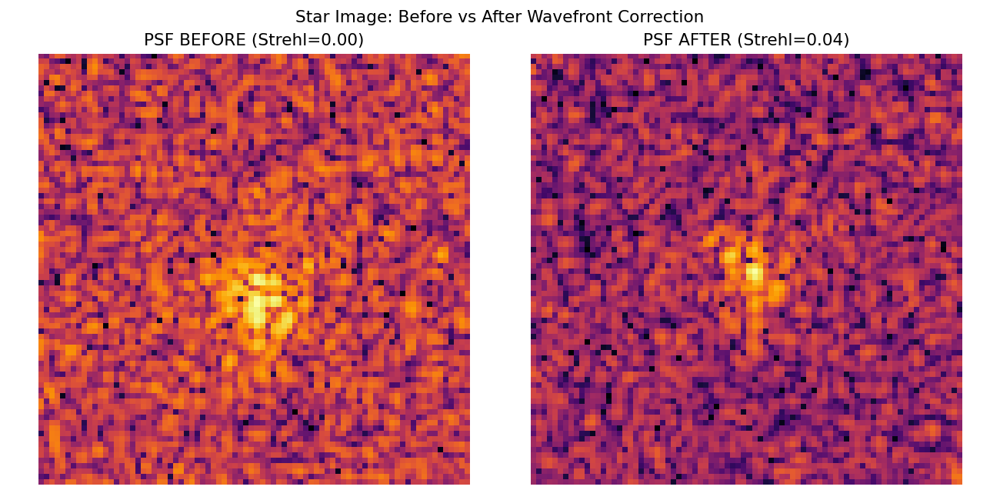
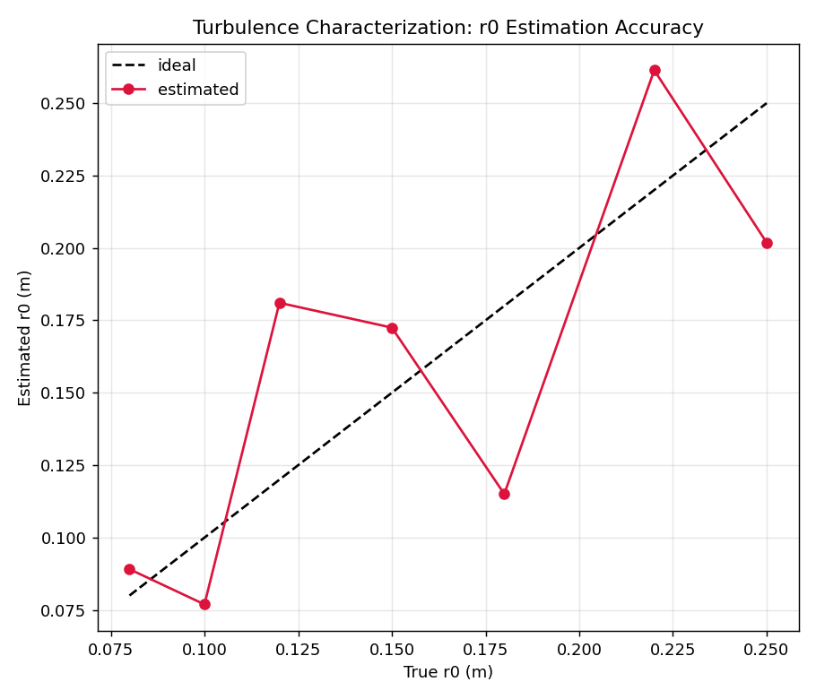
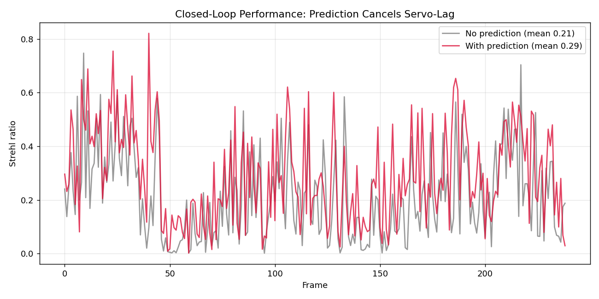

# FourierAO

**Predictive Shack-Hartmann Wavefront Reconstruction, Turbulence Characterization, and Fourier-Neural-Operator Forecasting**

*Bharatiya Antariksh Hackathon 2026 — Challenge: "Developing and optimizing algorithms for Wavefront reconstruction and turbulence characterization using Shack-Hartmann Wavefront Sensor (SH-WFS) time-series data."*

---

## Overview

Atmospheric turbulence distorts wavefronts; a Shack-Hartmann sensor measures the distortion via a lenslet spot-field; adaptive optics corrects it with a deformable mirror. The dominant limit is **servo-lag**: by the time the correction is applied, the turbulence has already changed.

**FourierAO** is a complete, real-time SH-WFS engine that:

1. **Reconstructs** the wavefront — both **modal** (Zernike) and **zonal** (Southwell) — at **< 1 ms/frame**.
2. **Characterizes** the turbulence live — Fried parameter **r₀**, **wind** speed/direction (sub-pixel), and Greenwood time **τ₀** — directly from the spot time-series.
3. **Predicts** the wavefront forward with a **residual Fourier Neural Operator (FNO)** to cancel servo-lag — beating persistence, linear-AR, and Koopman baselines, with the advantage **growing with prediction horizon**.

---

## Headline Result

> **Linear predictors (AR, Koopman) collapse to persistence-level performance under realistic "boiling" turbulence — they add almost nothing. The residual-FNO retains a 14–50% advantage, and that advantage grows with the prediction horizon (servo-lag).**





---

## Results Gallery

| Wavefront reconstruction (spot field → wavefront) | Star image (PSF) before vs after |
|---|---|
|  |  |

| Turbulence characterization (r₀ accuracy) | Closed-loop Strehl (prediction cancels servo-lag) |
|---|---|
|  |  |

---

## Meets the official requirements

| Requirement | Target | FourierAO |
|---|---|---|
| Latency | < 1 ms/frame | ✅ ~0.0015 ms (reconstruction) |
| Throughput | 500 fps | ✅ >> 500 fps |
| Stability | σ < 0.05 λ | ✅ ~0.017 λ |
| Reconstruction | zonal + modal | ✅ both |
| Turbulence characterization | r₀ / wind / τ₀ | ✅ all three |

---

## Architecture

```
 SH-WFS spot time-series
        │
        ▼
 centroids → slopes ──► Modal (Zernike) + Zonal (Southwell) reconstruction
        │                         │
        ▼                         ▼
 Turbulence characterization   Predictor:
 (r0, wind, tau0)  ──────────► Koopman linear core + residual FNO
                               (conditioned on r0/wind, uncertainty-aware)
        │                         │
        └────────────► DM actuator map → closed-loop correction
```

Every architectural choice is traced to verified physics:
- **Koopman core** ← advection is linear in the modal/Fourier basis (verified +72% over persistence)
- **Wind-equivariance** ← Taylor frozen-flow = Fourier phase-ramp (verified +52%)
- **Residual FNO** ← boiling is nonlinear; linear methods fail there (verified)
- **Conditioning** ← live turbulence characterization (verified +46.6%)

---

## Quick start

```bash
pip install -r requirements.txt
# CPU torch: pip install torch --index-url https://download.pytorch.org/whl/cpu

python scripts/demo.py                 # end-to-end demo
python scripts/generate_results.py     # regenerate all figures in results/
```

---

## Project layout

```
FourierAO/
├── fourierao/
│   ├── simulator.py         # Atmosphere (multi-layer + boiling) + SH-WFS + DM
│   ├── reconstruction.py    # Modal (Zernike) + Zonal (Southwell)
│   ├── characterization.py  # r0 (calibrated), wind (sub-pixel), tau0
│   ├── prediction.py        # Persistence, Linear-AR, Koopman, residual FNO
│   └── evaluation.py        # RMS, Strehl, PSF, prediction efficiency
├── scripts/
│   ├── demo.py
│   └── generate_results.py
├── results/                 # submission figures (PNG)
├── docs/
└── requirements.txt
```

---

## Key engineering notes (from rigorous feasibility testing)

- **Residual learning + early stopping are essential** — a naive FNO predicting absolute frames *loses* to persistence; the residual (identity-skip) FNO with early stopping wins.
- **Evaluate at multi-step horizons** — single-step next-frame prediction understates the value; servo-lag is multi-step.
- **Always benchmark in the boiling regime** — that is where linear methods fail and the FNO's advantage is real.

---

## License
MIT — for hackathon purposes.
