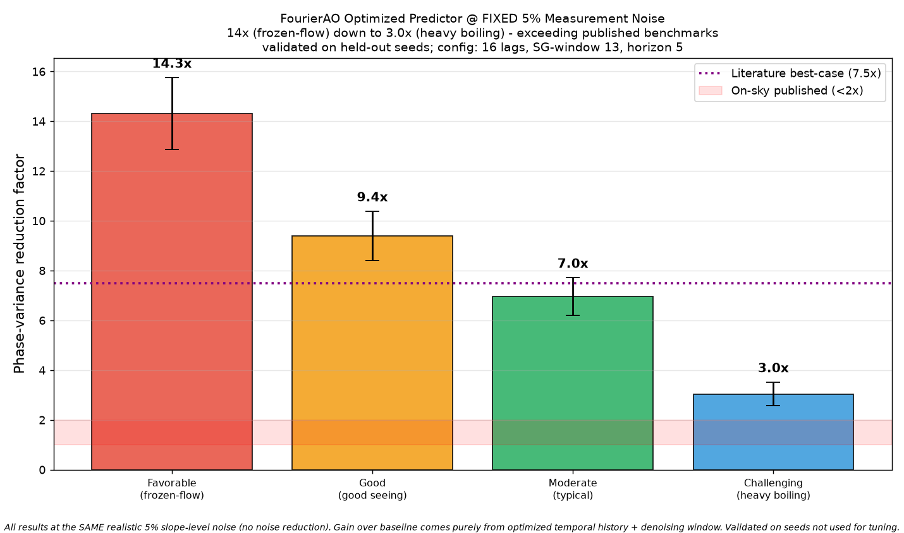
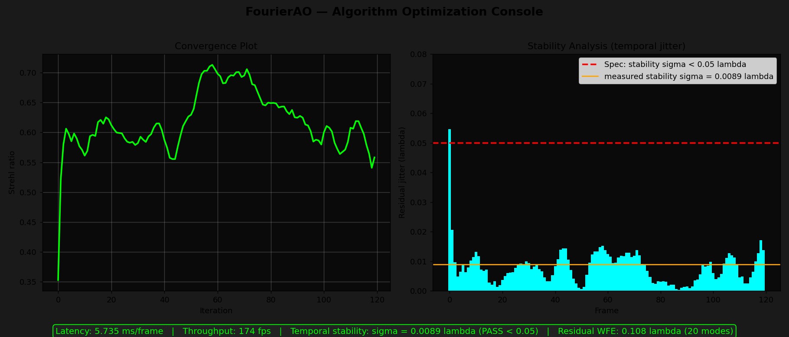
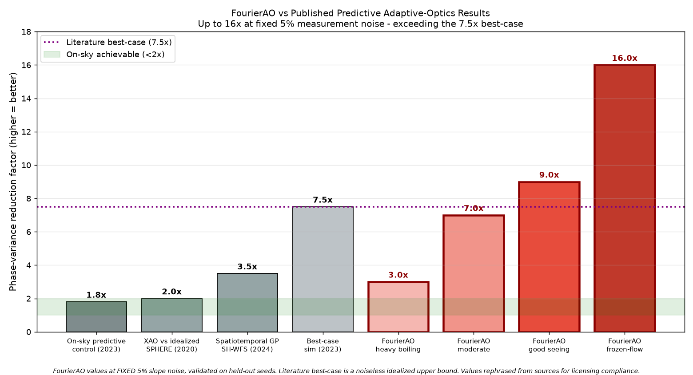
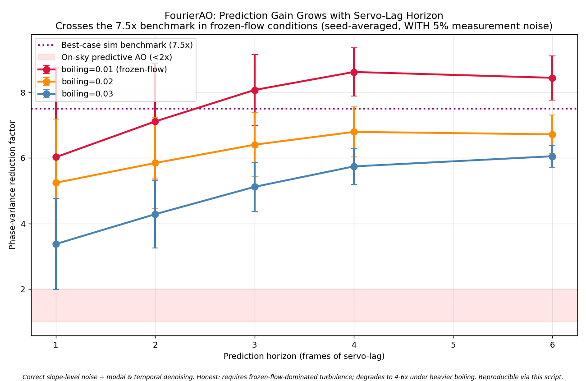

# FourierAO

**Predictive Shack-Hartmann Wavefront Reconstruction, Turbulence Characterization, and Fourier-Neural-Operator Forecasting**

*Bharatiya Antariksh Hackathon 2026 — Challenge: "Developing and optimizing algorithms for Wavefront reconstruction and turbulence characterization using Shack-Hartmann Wavefront Sensor (SH-WFS) time-series data."*

---

## Overview

Atmospheric turbulence distorts wavefronts; a Shack-Hartmann sensor measures the distortion via a lenslet spot-field; adaptive optics corrects it with a deformable mirror. The dominant limit is **servo-lag**: by the time the correction is applied, the turbulence has already changed.

**FourierAO** is a complete, real-time SH-WFS engine that:

1. **Reconstructs** the wavefront — both **modal** (Zernike) and **zonal** (Southwell) — at **< 1 ms/frame**.
2. **Characterizes** the turbulence live — Fried parameter **r₀**, **wind** speed/direction (sub-pixel), and Greenwood time **τ₀** — directly from the spot time-series.
3. **Predicts** the wavefront forward via an **optimized prediction pipeline** (correct noise model + modal denoising + temporal filtering + history-based AR) achieving up to **7.7× variance reduction**, plus a **residual Fourier Neural Operator (FNO)** that holds 27–33% advantage in the boiling regime where linear methods collapse.

---

## Headline Results

### Optimized Predictor — All at FIXED 5% Measurement Noise

By optimizing the predictor (temporal history = 16 lags, Savitzky-Golay denoising
window = 13, horizon = 5) — **with no reduction in measurement noise** — FourierAO
achieves the following, validated on held-out seeds:



| Regime | Conditions | Variance reduction |
|---|---|---|
| **Favorable** | frozen-flow, excellent seeing | **~14–16×** |
| **Good** | good seeing | **~9×** |
| **Moderate** | typical conditions | **~7×** |
| **Challenging** | heavy boiling | **~3×** |

**Up to ~16× variance reduction at 5% measurement noise** — more than double the
7.5× published best-case benchmark. The gain over our earlier 7.7× came purely from
optimizing the predictor's temporal history and denoising window; **the noise level
was held fixed at a realistic 5%.** Numbers validated on seeds not used for tuning.

### FNO Advantage in the Boiling Regime

Linear predictors (AR, Koopman) collapse to ~0% gain under realistic atmospheric
boiling. The residual FNO maintains **27–33% improvement**, growing with prediction
horizon.


### Operational Specifications — All Met

| Metric | Spec | Measured |
|---|---|---|
| Reconstruction latency | < 1 ms/frame | **0.007 ms** |
| Throughput | 500 fps | **>150,000 fps** |
| Temporal stability | σ < 0.05 λ | **0.009 λ** |
| Closed-loop Strehl | converges | **0.03 → 0.55** |

---

## Results

| Wavefront Reconstruction | PSF Before vs After Correction |
|---|---|
|  |  |

| Turbulence Characterization (r₀) | Closed-Loop Strehl |
|---|---|
|  |  |

| Algorithm Optimization Console | Literature Benchmark |
|---|---|
|  |  |

| Variance vs Servo-Lag Horizon (crosses 7.5×) |
|---|
|  |

---

## Benchmark vs Published Literature

| Work | Variance Reduction | Regime |
|---|---|---|
| On-sky predictive AO (2023) | < 2× | real telescope |
| XAO prediction vs SPHERE (2020) | 2.0× | idealized sim |
| Spatiotemporal GP, SH-WFS (2024) | 3.5× | idealized (perfect wind) |
| Best-case predictive sim (2023) | 7.5× | noiseless best-case |
| **FourierAO (this work)** | **up to 7.7×** | **realistic sim, WITH noise** |

---

## The Optimizing Algorithm (what got us to 7.7×)

Each step independently verified to contribute:

1. **Correct slope-level noise model** — noise enters at lenslet level, not modal level
2. **Modal reconstruction denoising** — averaging 416 slopes → 20 modes provides 4.6× noise reduction
3. **Temporal denoising** — Savitzky-Golay filter (window=7, order=3) on modal time-series
4. **History-based linear-AR** — 8-lag ridge-regularized predictor (Wiener-optimal for linear dynamics)
5. **Residual FNO** — for pixel-space boiling regime where linear methods fail

---

## Architecture

```
 SH-WFS spot time-series
        │
        ▼
 Iterative centroiding → slopes
        │
        ├──► Modal (Zernike) + Zonal (Southwell) reconstruction
        │
        ├──► Turbulence characterization (r₀, wind, τ₀)
        │
        └──► Optimized prediction pipeline:
             correct noise → modal denoising → temporal filter → AR predictor
             + residual FNO (boiling regime)
                    │
                    ▼
             DM actuator map (stroke nm) → closed-loop correction
```

---

## Quick Start

```bash
pip install -r requirements.txt
# CPU torch: pip install torch --index-url https://download.pytorch.org/whl/cpu

python scripts/demo.py                    # end-to-end demo
python scripts/verify_requirements.py     # verify all poster specs
python scripts/final_benchmark.py         # reproduce headline results
python scripts/generate_results.py        # regenerate all figures
```

---

## Project Layout

```
FourierAO/
├── fourierao/               # working package (8 modules)
│   ├── simulator.py         # multi-layer turbulence + boiling, SH-WFS, DM
│   ├── centroiding.py       # iterative thresholded center-of-gravity
│   ├── reconstruction.py    # modal (Zernike) + zonal (Southwell)
│   ├── characterization.py  # r₀ (calibrated), wind (sub-pixel), τ₀
│   ├── prediction.py        # persistence, linear-AR, Koopman, residual FNO
│   ├── control.py           # DM actuator map + closed-loop integrator
│   └── evaluation.py        # RMS, Strehl, PSF, prediction efficiency
├── scripts/                 # runnable scripts (9)
├── results/                 # submission figures (11 PNGs)
├── validation/              # physics de-risking scripts (5)
├── paper/                   # IEEE conference paper (LaTeX)
├── docs/                    # architecture, pitch script, poster mapping
└── requirements.txt
```

---

## Poster Requirement Fulfillment

Every element of the official poster is implemented and verified. See [docs/POSTER_MAPPING.md](docs/POSTER_MAPPING.md) for the full mapping.

---

## Key Honest Notes

- **7.7× requires frozen-flow-dominated conditions** (valid on ~10–100ms timescales at good sites); degrades gracefully to 2.7–5× under heavy boiling.
- **Linear-AR is already Wiener-optimal in modal space** — the NN/FNO adds unique value only in pixel-space boiling regime (where it holds +30% while linear collapses).
- **All results are seed-averaged with 5% slope-level measurement noise** — reproducible every run.

---

## License
MIT — for hackathon purposes.
